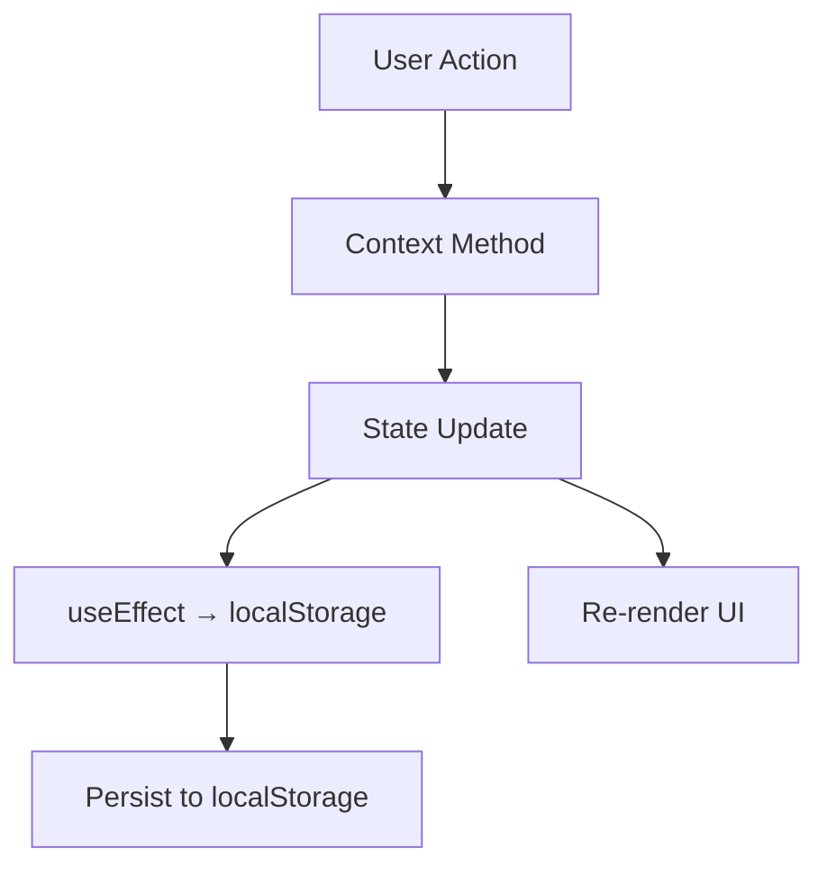

<p align="center">
  
  
  
</p>

<h1 align="center">✨ Iconic. — Organize your chaos.</h1>

<p align="center">
  <strong>A dopamine-fueled Kanban task board with drag-and-drop, built for the modern aesthetic.</strong><br/>
  Pure vibes, zero clutter, maximum productivity.
</p>

---

## 📋 Table of Contents

- [Overview](#-overview)
- [Features](#-features)
- [Tech Stack](#-tech-stack)
- [Project Structure](#-project-structure)
- [Getting Started](#-getting-started)
- [Usage Guide](#-usage-guide)
- [Authentication](#-authentication)
- [Architecture](#-architecture)
- [Testing](#-testing)
- [Scripts Reference](#-scripts-reference)
- [Contributing](#-contributing)
- [License](#-license)

---

## 🌟 Overview

**Iconic.** is a sleek, premium Kanban-style task management board built with **React 19** and **Vite**. It features a stunning dark-mode interface with glassmorphism, gradient accents, and smooth animations powered by **Framer Motion**. Tasks can be dragged and dropped across columns via **@dnd-kit**, searched, filtered by priority, and sorted — all while persisting seamlessly to **localStorage**.

The app ships with a beautiful landing page, animated auth screens (Login & Register), and a fully functional board with an activity log that tracks the last 10 actions.

---

## 🚀 Features

### ✅ Task Management
| Feature | Description |
|---------|-------------|
| **Create** | Add tasks with title, description, priority (Low / Medium / High), due date, and comma-separated tags |
| **Edit** | Inline editing via a modal form with pre-populated fields |
| **Delete** | One-click deletion with instant UI feedback |
| **Drag & Drop** | Move tasks between columns using `@dnd-kit` with pointer and keyboard sensor support |

### 🔍 Search, Filter & Sort
| Feature | Description |
|---------|-------------|
| **Search** | Real-time title search across all tasks |
| **Filter** | Filter by priority — All, High, Medium, Low |
| **Sort** | Toggle between Due Date (ascending) and Created At (newest first) |

### 📊 Board Columns
The board uses three columns with a fun naming convention:
- 🌀 **CHAOS (To-Do)** — Tasks waiting to be started
- 🔥 **VIBE (Doing)** — Tasks currently in progress
- 💎 **ICONIC (Done)** — Completed tasks

### 🔐 Authentication
- Static credential-based login (`intern@demo.com` / `intern123`)
- _Remember Me_ support via `localStorage` vs `sessionStorage`
- Protected routes redirect unauthenticated users to `/login`
- Profile dropdown with logout and board reset options

### 📝 Activity Log
- Tracks the **last 10 actions** (create, edit, move, delete, reset)
- Slide-in panel with contextual emoji icons (✨ created, 🔥 moved, ✏️ edited, 🗑️ deleted, 🔄 reset)
- Each entry includes a human-readable timestamp

### 💾 Persistence
- All tasks and logs are automatically saved to **localStorage** under the key `task_board`
- Auth session persists via `auth_user` key in localStorage/sessionStorage
- Data survives page refreshes and browser restarts

### 🎨 Design & UX
- **Dark mode** with mesh gradient backgrounds and noise overlays
- **Glassmorphism** cards with backdrop blur
- **Animated light leaks** floating in the background
- **Space Grotesk** typography + **Material Symbols** icons
- **Framer Motion** spring animations for modals
- Fully **responsive** — adapts from mobile to desktop

---

## 🛠️ Tech Stack

| Category | Technology | Version |
|----------|-----------|---------|
| **UI Library** | React | 19.2 |
| **Build Tool** | Vite | 7.3 |
| **Drag & Drop** | @dnd-kit/core + sortable | 6.3 / 10.0 |
| **Animations** | Framer Motion | 12.34 |
| **Icons** | Lucide React + Material Symbols | 0.564 |
| **Routing** | React Router DOM | 7.13 |
| **Date Utilities** | date-fns | 4.1 |
| **CSS Utilities** | clsx, tailwind-merge | 2.1 / 3.4 |
| **Testing** | Vitest + Testing Library + jsdom | 4.0 / 16.3 / 28.1 |
| **Linting** | ESLint | 9.39 |

---

## 📁 Project Structure

```
frontend/
├── index.html                  # Entry HTML with Google Fonts
├── package.json                # Dependencies & scripts
├── vite.config.js              # Vite + Vitest configuration
├── eslint.config.js            # ESLint rules
├── public/                     # Static assets
│   └── vite.svg
└── src/
    ├── main.jsx                # React root entry point
    ├── App.jsx                 # Router setup + Landing page component
    ├── App.css                 # App-level styles
    ├── index.css               # Global CSS reset
    │
    ├── context/
    │   ├── AuthContext.jsx      # Authentication state & login/logout logic
    │   └── TaskContext.jsx      # Task CRUD, filtering, sorting, activity log
    │
    ├── pages/
    │   ├── Login.jsx            # Login page with glassmorphic card
    │   ├── Register.jsx         # Registration page
    │   └── Board.jsx            # Main Kanban board with DnD context
    │
    ├── components/
    │   ├── ProtectedRoute.jsx   # Auth guard — redirects to /login if not logged in
    │   ├── TaskColumn.jsx       # Droppable column with sortable context
    │   ├── TaskCard.jsx         # Draggable task card with priority badge
    │   ├── TaskForm.jsx         # Create/Edit task modal with validation
    │   └── ActivityLog.jsx      # Slide-in activity log panel
    │
    ├── utils/
    │   └── storage.js           # localStorage helpers (save/load with error handling)
    │
    ├── styles/
    │   ├── global.css           # Base styles, CSS variables
    │   └── components.css       # Component-level styles
    │
    ├── tests/
    │   ├── setupTests.js        # Vitest setup with jsdom & jest-dom matchers
    │   ├── Auth.test.jsx        # Authentication component tests
    │   ├── AuthLogic.test.jsx   # Auth context logic tests
    │   └── Tasks.test.jsx       # Task management tests
    │
    └── assets/
        └── react.svg            # React logo asset
```

---

## ⚡ Getting Started

### Prerequisites

- **Node.js** ≥ 18.x
- **npm** ≥ 9.x (or use `yarn` / `pnpm`)

### Installation

```bash
# 1. Clone the repository
git clone https://github.com/<your-username>/iconic-board.git

# 2. Navigate to the frontend directory
cd iconic-board/frontend

# 3. Install dependencies
npm install

# 4. Start the development server
npm run dev
```

The app will be available at **http://localhost:5173** (default Vite port).

---

## 📖 Usage Guide

### 1️⃣ Landing Page
Visit `/` to see the animated landing page with a hero section and an interactive board preview. Click **"Start Crushing Tasks"** or **"Log In"** to proceed.

### 2️⃣ Login
Navigate to `/login` and enter the demo credentials:

| Field | Value |
|-------|-------|
| Email | `intern@demo.com` |
| Password | `intern123` |

### 3️⃣ Board
Once authenticated, you're taken to `/board` where you can:

- **Create a task** → Click the `+` button on any column header, or click "Create First Task" if the board is empty
- **Edit a task** → Hover over a task card and click the ✏️ edit icon
- **Delete a task** → Hover and click the 🗑️ delete icon
- **Move a task** → Drag and drop it between columns
- **Search** → Type in the search bar in the top nav
- **Filter** → Use the priority dropdown (All / High / Medium / Low)
- **Sort** → Click the sort button to toggle between Due Date and Newest
- **Activity Log** → Click the clock/history icon to view recent actions
- **Reset Board** → Click your profile avatar → "Reset Board"
- **Logout** → Click your profile avatar → "Log Out"

---

## 🔐 Authentication

The app uses a **static credentials** system for demo purposes:

```
Email:    intern@demo.com
Password: intern123
```

### How It Works

1. `AuthContext` manages the `user` state and provides `login`, `logout`, and `isLogged` values
2. On login, the user data is stored in either `localStorage` (remember me) or `sessionStorage`
3. On mount, the app checks `localStorage` for an existing session
4. `ProtectedRoute` wraps the `/board` route — any unauthenticated access redirects to `/login`
5. The Register page calls the same `login` function (demo-only behavior)

---

## 🏗️ Architecture

### State Management

The app uses **React Context API** with two providers:

```
AuthProvider (global)
  └── Router
       └── TaskProvider (wraps /board only)
            └── Board → Columns → Cards
```

- **`AuthContext`** — Manages user authentication state, login/logout methods, and session persistence
- **`TaskContext`** — Manages all task data (CRUD), activity logs, search query, priority filter, and sort mode. Uses `useMemo` for filtered/sorted task lists

### Data Flow



### Key Design Decisions

| Decision | Rationale |
|----------|-----------|
| **localStorage** for persistence | No backend needed; instant reads; data persists across sessions |
| **Context API** over Redux | Sufficient for this app size; reduces bundle; simpler mental model |
| **@dnd-kit** over react-beautiful-dnd | Actively maintained; better a11y; supports both pointer and keyboard sensors |
| **CSS-in-JS (inline `<style>`)** | Collocated styles per component; no CSS module config needed |
| **Framer Motion** for modals | Spring-based physics animations feel premium and organic |

---

## 🧪 Testing

The project uses **Vitest** with **React Testing Library** and **jsdom** for unit/component testing.

### Run Tests

```bash
# Run all tests
npm test

# Run tests with the Vitest UI
npm run test:ui
```

### Test Files

| File | Coverage |
|------|----------|
| `Auth.test.jsx` | Renders Login page, form validation, credential submission |
| `AuthLogic.test.jsx` | AuthContext logic — successful/failed login behavior |
| `Tasks.test.jsx` | Task creation, deletion, status updates via TaskContext |

### Setup

The test environment is configured in `vite.config.js`:

```js
test: {
  globals: true,
  environment: 'jsdom',
  setupFiles: './src/tests/setupTests.js',
}
```

---

## 📜 Scripts Reference

| Script | Command | Description |
|--------|---------|-------------|
| `dev` | `npm run dev` | Start Vite dev server with HMR |
| `build` | `npm run build` | Create optimized production build |
| `preview` | `npm run preview` | Preview the production build locally |
| `test` | `npm test` | Run Vitest test suite |
| `test:ui` | `npm run test:ui` | Open Vitest UI in browser |
| `lint` | `npm run lint` | Lint with ESLint |

---

## 🤝 Contributing

1. **Fork** this repository
2. **Create** a feature branch (`git checkout -b feature/amazing-feature`)
3. **Commit** your changes (`git commit -m 'Add amazing feature'`)
4. **Push** to the branch (`git push origin feature/amazing-feature`)
5. **Open** a Pull Request

### Code Style

- Use functional components with hooks
- Follow the existing CSS-in-JS pattern (inline `<style>` blocks)
- Write tests for new features in `src/tests/`
- Keep components focused and reusable

---

## 📄 License

This project is licensed under the **MIT License**. See [LICENSE](LICENSE) for details.

---

<p align="center">
  <strong>Built with 💜 using React + Vite</strong><br/>
  <em>Organize your chaos. Make it iconic.</em> ✨
</p>
